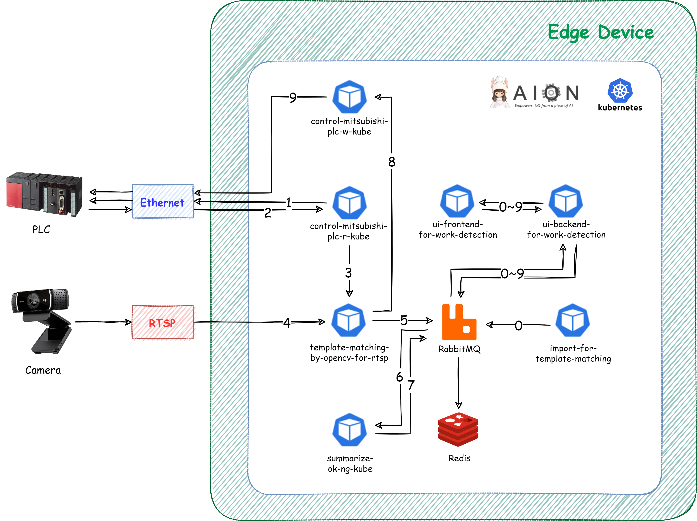

# work-detection-system　　
work-detection-system は、エッジコンピューティング環境において、取得したカメラ映像に対してあらかじめ指定したテンプレート画像および閾値を元にテンプレートマッチングを行い、その結果をUI上に表示するシステムです。  

## 動作環境

* OS: Linux  
* CPU: ARM/AMD/Intel  
* aion-core および 関連リソース  

## work-detection-system のアーキテクチャ   
以下の図はwork-detection-systemのアーキテクチャ図です。  

図内の赤い矢印の詳細順序は以下の通りです。   
XXXXXXXXXXXXXXX
XXXXXXXXXXXXXX

## work-detection-system に含まれるリソース

container-deployment-system には、以下の マイクロサービス等 のリソースが含まれます。  
XXXXXXXXXXXXXXXXXXXXXXXXXXXXX

